# home

## Welcome to my home page on github !
This is a summary of what I was able to do as an important or funny project.

# RDV Piercing
Link of app: https://rdv-piercing.cleverapps.io
## Summary of app
This is an app for piercing appointment. You go on the site, choose your piercing parlor and take an appointment.
The github repo is private, because is a client app.
## Programming language
Spring boot with Kotlin, HTML, CSS, jQuery with JS, PostreSQL
## Screen of user root
### Choose a piercing parlor:
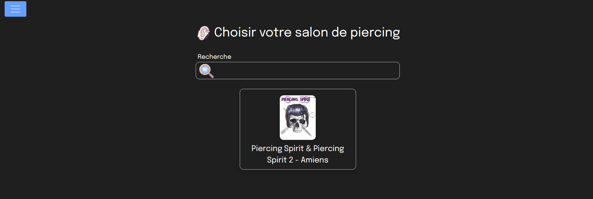
### Fill the form to take an appointment:
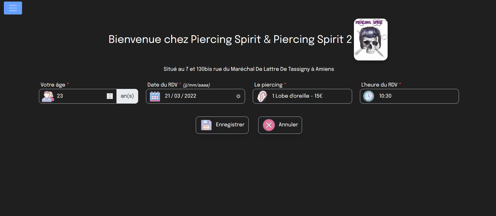
### Take appointment and show it:
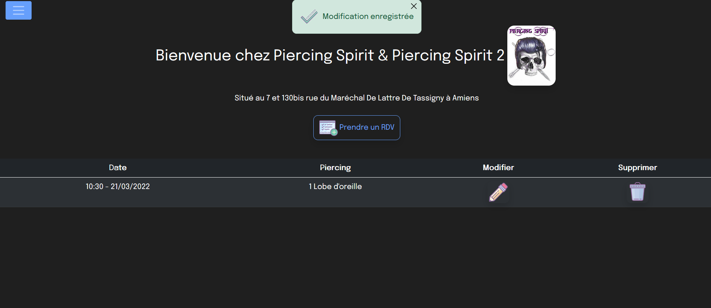
### Receive an email the day before:
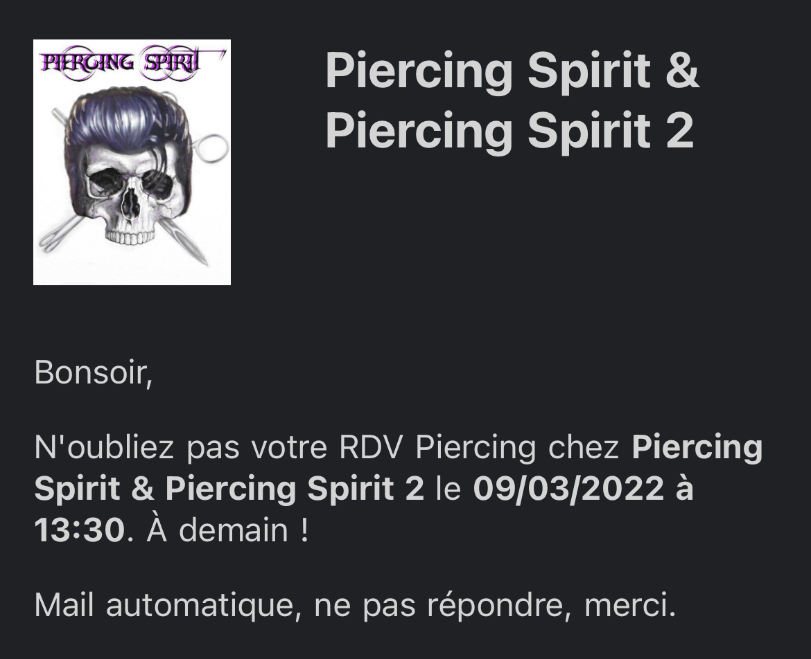
## Screen of admin root
### Main of admin root:
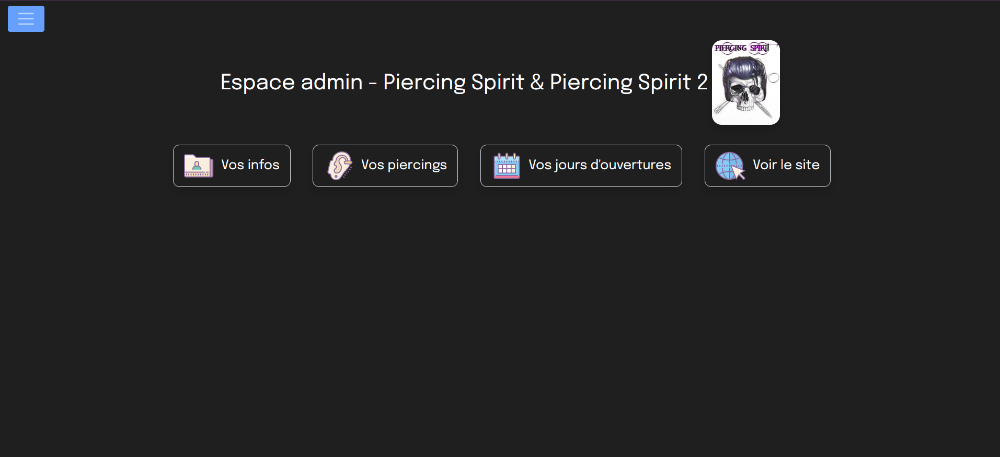
### Client informations:
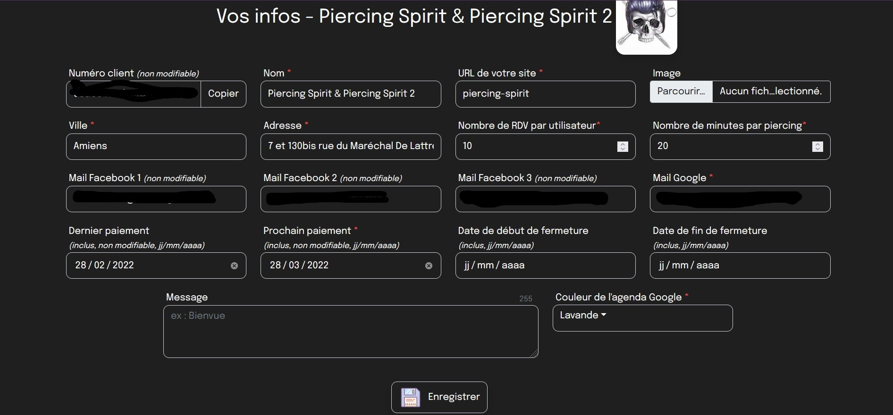
### Add a piercing:
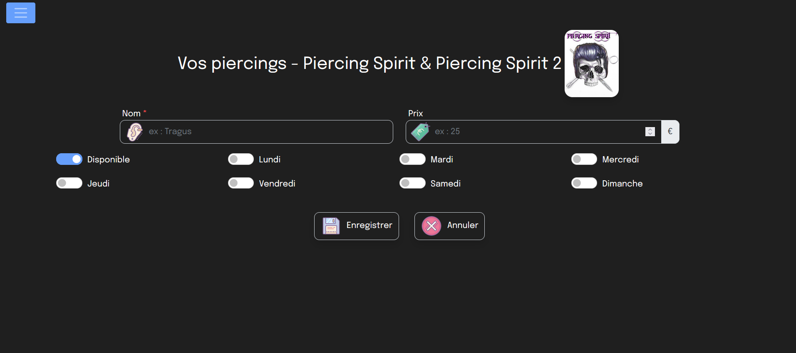
### Show all piercings:
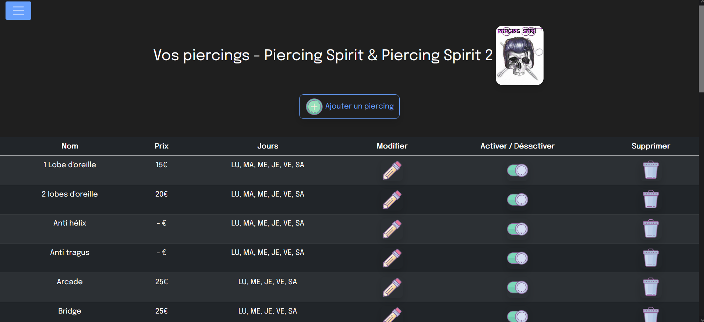
### Show and update hours:
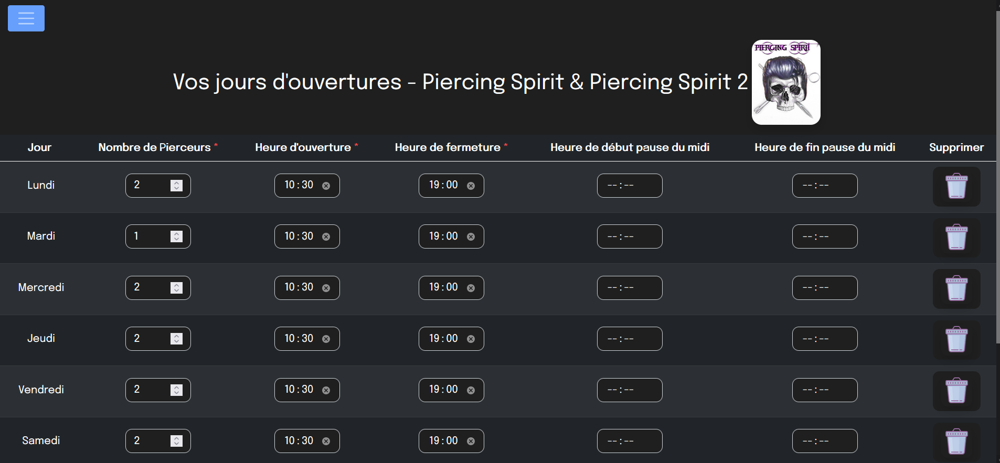

# SARL Delattre Horaire
## Summary of app
This is an intern app to take work hours. The client is a green space company. The app calculate the hours and the mileage allowances, and write the informations on a google sheet. The github repo is private, because is a client app.
## Programming language
Microservice, Spring boot with Java, Flask with Python, HTML, CSS, jQuery with JS
## Screen of app
### Fill the form:
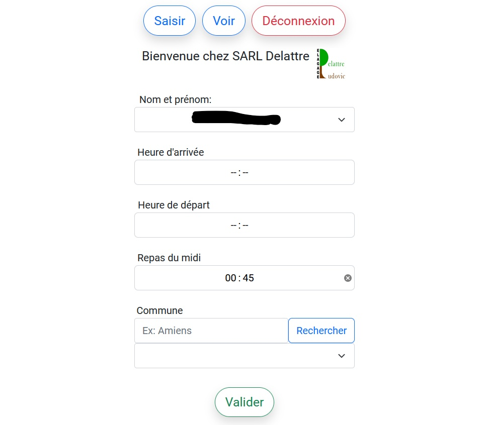
### Show all hours:
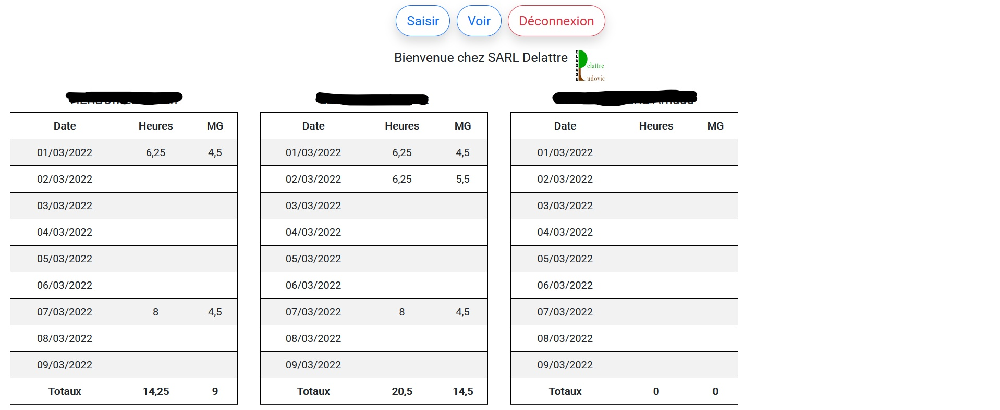

# Call of Duty API
Link of github repo: https://github.com/debroucker/cod
## Summary of app
This is an app to collect stats of your Call od Duty: Modern Warfare game. Just lunch the app and it will get your game stats.
## Programming language
Python, HTML, CSS
### Global stats per month, with the % of number of games are bronze, silver, etc:
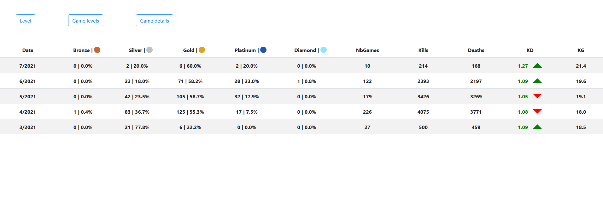
### Stats for each games:
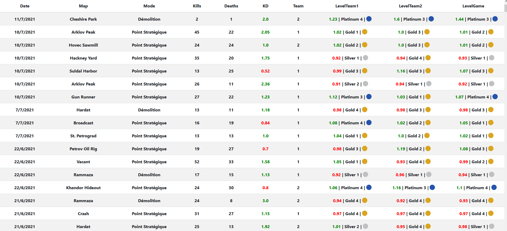
### Stats of each players, for each games:
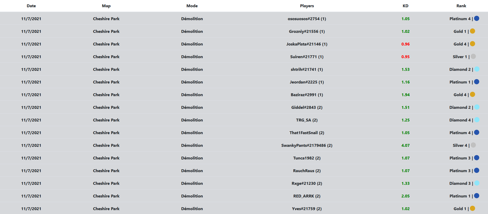

